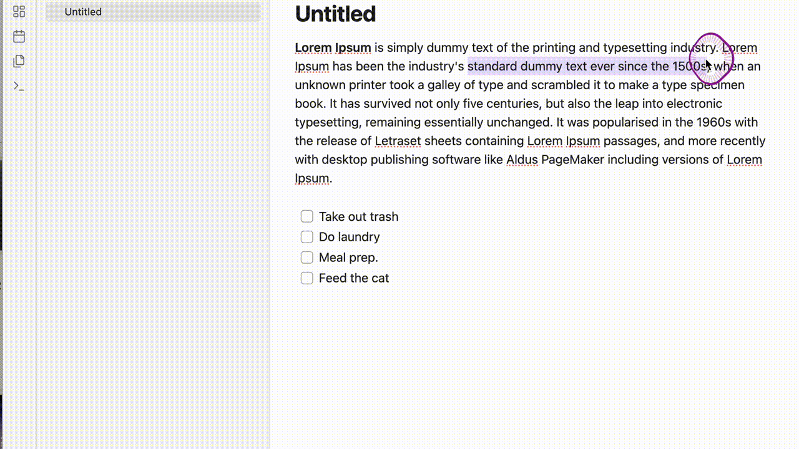

# Drag Board

A draggable card board for Obsidian that lets you visually manage:

---

## DEMO



## How to use

Just insert this code block in any note:

    ```drag-board
    ```

Use the dropdown to switch between **highlights** or **tasks** mode.

---

## 🎨 Features

- Drag, scale, and color cards
- Focus card in editor
- Delete card from note
- Works in both light and dark modes
---
